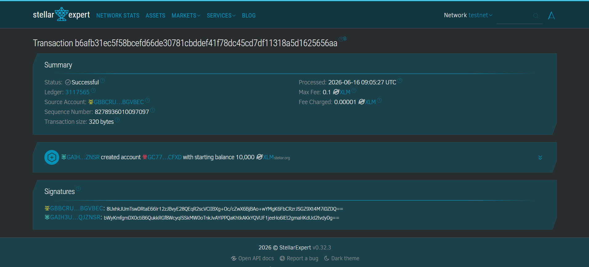

# TipContract-Soroban

## Project Title
TipContract-Soroban

---

## Project Description
TipContract-Soroban is a decentralized smart contract platform built on the Stellar blockchain using Soroban SDK to manage tipping activities between users.

It enables users to send tips with messages directly on-chain while ensuring all transactions are transparently stored, immutable, and publicly verifiable. The contract maintains full tip history, total tip amount, and tip count for complete transparency.

---

## Project Vision
The vision of TipContract-Soroban is to create a trustless and transparent tipping system that eliminates intermediaries between supporters and creators.

By leveraging blockchain technology, all tips become immutable records that can be publicly verified, ensuring fairness, openness, and direct value transfer in digital communities.

---

## Key Features

- **Decentralized Tipping System:** Users can send tips directly on-chain without intermediaries
- **Message Support:** Each tip includes a custom message
- **Total Tip Tracking:** Automatically tracks total tipped amount
- **Tip Counter:** Maintains number of tips sent
- **On-chain History:** Stores all tip records permanently on blockchain
- **Tip Querying:** Retrieve individual tips or full tip history
- **Authentication Control:** Only authorized users can send tips
- **Immutable Storage:** All data stored securely on Soroban persistent storage

---

## Usage Instructions

1. **Initialize Contract:** Deploy and initialize contract with an owner
2. **Send Tip:** Users send tips with message and amount
3. **Track Tips:** System automatically updates total tips and count
4. **Query Data:** Anyone can view total tips, tip count, or full history
5. **Get Tip Detail:** Retrieve specific tip by ID

---

## Future Scope

- **Token Integration:** Support XLM or custom token-based tipping
- **Frontend Dashboard:** Build UI for users to send and track tips
- **Event Logging:** Emit events for real-time frontend indexing
- **Pagination Support:** Optimize retrieval for large tip datasets
- **Analytics System:** Track top supporters and tipping activity
- **Withdrawal System:** Allow creators to withdraw accumulated tips
- **Social Integration:** Connect tipping with social platforms

---

## Technology Stack

- Rust 🦀
- Soroban SDK
- Stellar Blockchain 🌐

---

## Contribution

Contributions are welcome from blockchain developers and Rust engineers.

Feel free to fork this repository, improve functionality, or extend it with frontend integration.

---

## License
This project is licensed under the MIT License.

---

## Contract Details

- **Contract Name:** TipContract-Soroban
- **Blockchain:** Stellar (Soroban)
- **Network:** Testnet
- **Contract ID:** CAN7NICCSRWLI3IVMNIER6YATU6U4EMRQK374XOODXQNTHP4TVVGC2HD


---

## Deployment Information

### Build Contract
```bash
cargo build --target wasm32-unknown-unknown --release